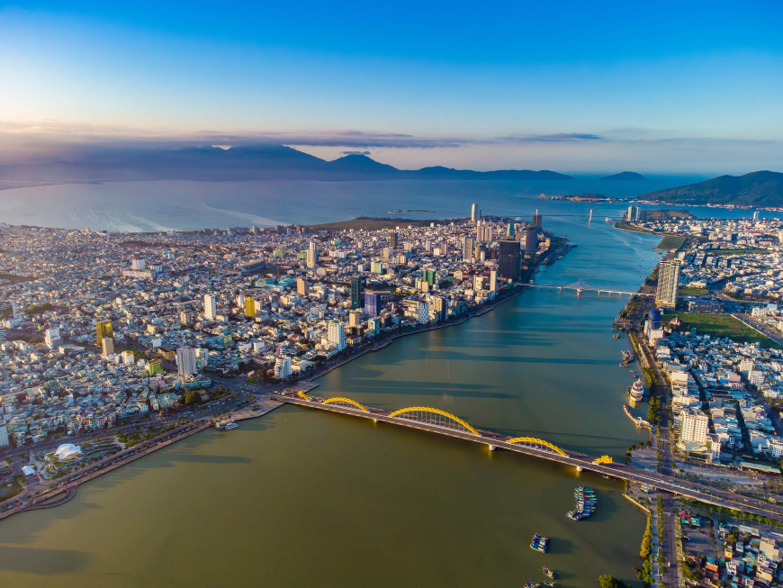
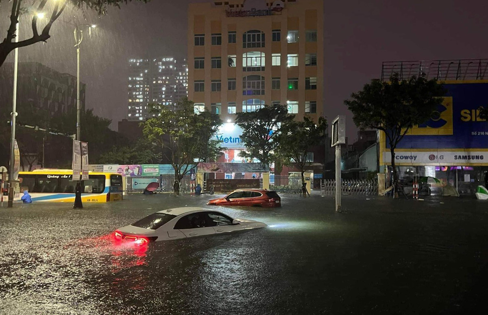
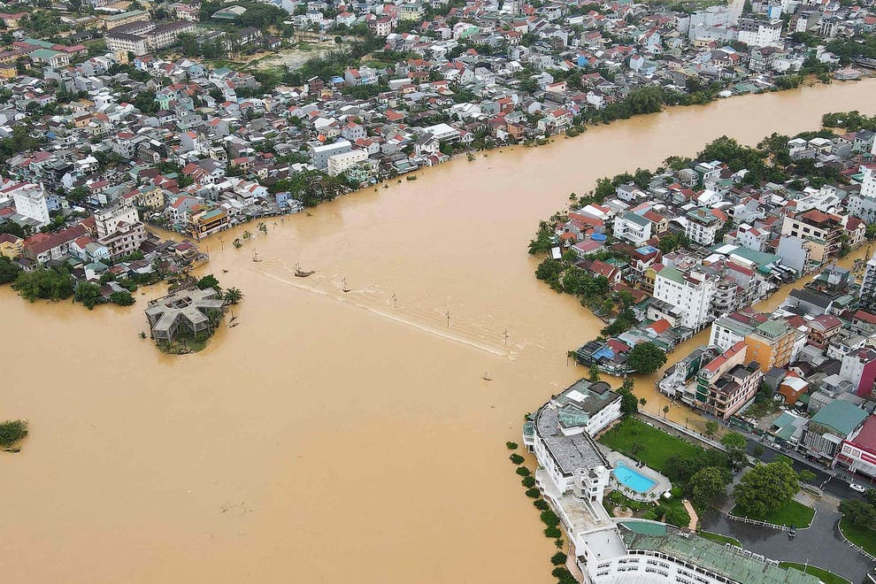
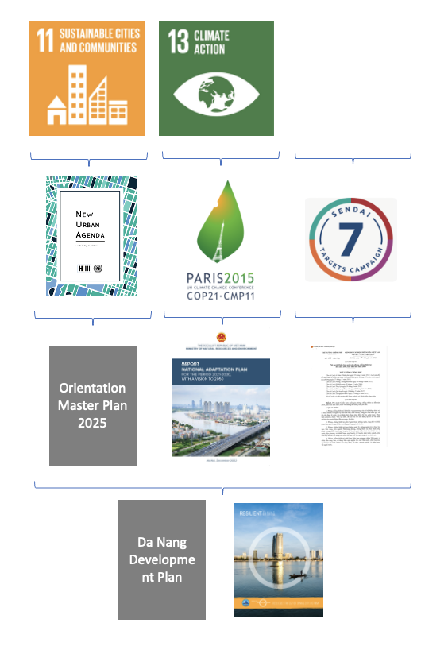
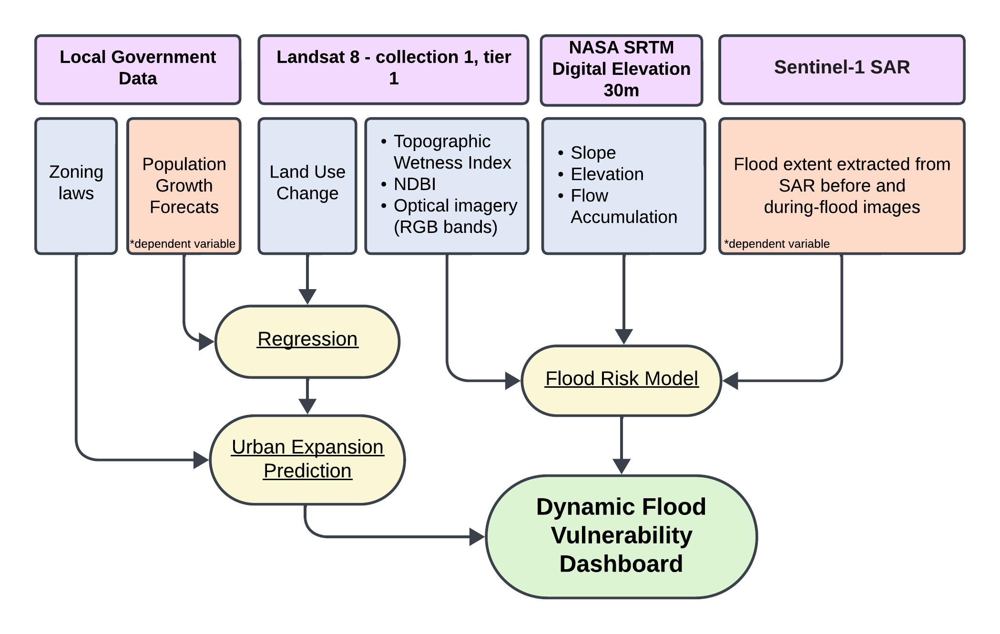
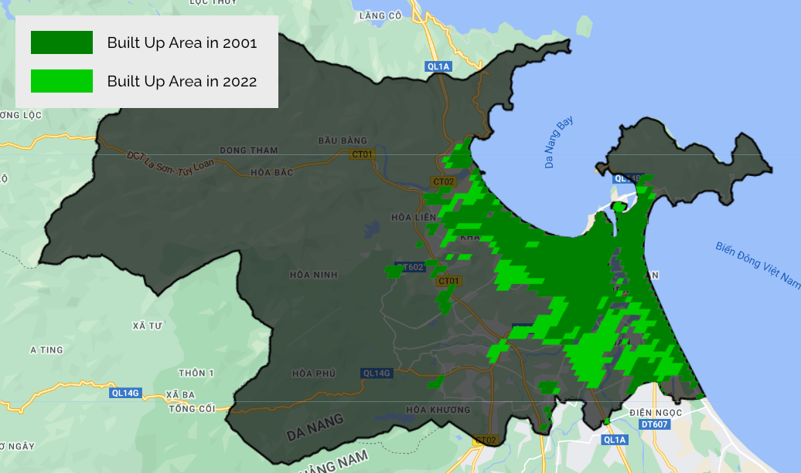

```{r setup, include=FALSE}
options(htmltools.dir.version = FALSE)

library(RefManageR)
BibOptions(check.entries = FALSE,
           bib.style = "authoryear",
           cite.style = "authoryear",
           style = "markdown",
           hyperlink = TRUE,
           dashed = FALSE,
           no.print.fields=c("doi", "url", "urldate", "issn"))
myBib <- ReadBib("./Bib.bib", check = FALSE)

library(knitcitations)
```

```{r xaringan-themer, include=FALSE, warning=FALSE}
# library(xaringanthemer)
# style_mono_light(
#   base_color = "#23395b",
#   header_font_google = google_font("Josefin Sans"),
#   text_font_google   = google_font("Montserrat", "300", "300i"),
 #  code_font_google   = google_font("Fira Mono")
# )
```

class: inverse, center, middle
background-image: url('img/sentinel_zoom_out.png')
background-size: cover
# .h1-background[The City: Da Nang, Vietnam]

.footnote-background[`r Citep(myBib, "europeanspaceagencySentinel2024")` ] 

---
## City Background

.pull-left[
**Central Vietnam's Largest City**
  * Population: 1,374,562 as of 2019 - `r Citep(myBib, "CongBoKet")` 
  * Major Port for the Central Coast - `r Citep(myBib, "100rcdanangteamResilienceCityNang2016")` 
  
**Climate**
  * Extremely hot and humid
      * 80% annual average humidity
      * 25.9C˚ mean annual temperature
  * Wet season from September to March - `r Citep(myBib, "opitz-stapletonHeatIndexTrends2016")` 

  
]

.pull-right-image[
```{r, echo = FALSE, out.width='75%', fig.align='center'}
  
```

.center[Central Da Nang - `r Citet(myBib, "vietnamtourismReasonsWhyNang")`]

```{r, echo = FALSE, out.width='75%', fig.align='center'}
  knitr::include_graphics('img/da_nang_loc.png')
```

.center[Da Nang within Vietnam - `r Citet(myBib, "encyclopediabritannicaNangVietnam2024")`]
]

---
## The Problem:

### Da Nang's rapid urbanisation puts it at increased risk of flooding

**Development in lowland areas is a key concern** - `r Citep(myBib, "huongAnalysisUrbanExpansion")`

**Floods of all kinds caused £83m in damage from 1998-2020**

.pull-left[
```{r, echo = FALSE, out.width='85%', fig.align='center'}
  
```
]

.pull-right[
```{r, echo = FALSE, out.width='85%', fig.align='center'}
  knitr::include_graphics('img/people_in_water.jpg')
```
]

.footnote-cite[Sources: `r Citet(myBib, "vnexpressRapidUrbanizationDelivers")`, `r Citet(myBib, "danangtoday000HomesSubmerged2020")`, `r Citet(myBib, "thianFloodVulnerabilityAssessment2022")`]

---
## Social Impacts

- **Increased Vulnerability:** Lowland communities, often poorer, face heightened flood risks, impacting economic well-being and increasing indebtedness.

- **Education Disruption:** Annual floods lead to school closures, affecting over 200,000 children with long-term absences impacting education, especially in specific wards.

- **Community Cohesion:** Despite challenges, community cohesion reportedly increases post-disasters.

- **Fatalities and Displacement:** Flooding has led to fatalities and significant displacement, with thousands evacuated and schools closed affecting hundreds of thousands of children.

---

## Economic Impacts

.pull-left[

**Income Reduction:**
Households, especially in certain wards, experience up to a 50% decrease in income post-flooding.

**Increased Borrowing:**
Affected households often resort to borrowing, with a significant percentage taking loans from relatives or credit institutions. 

**Infrastructure Damage:**
Flooding has caused extensive damage to infrastructure, including crops, power stations, and houses, leading to substantial economic losses estimated in millions of dollars.

]

.pull-right-image[

```{r, echo = FALSE, out.width='95%', fig.align='center'}
  knitr::include_graphics('img/vietnam_economic_zones.png')
```

.center[Economic Zones of Vietnam - `r Citet(myBib, "zhouFirmLevelEvidence2021")`]

]

---

## Environmental Impacts

**Water Quality Deterioration:** Post-flood water quality changes adversely affect community health, with a notable percentage of households experiencing poorer water supply quality.

**Waste Management Challenges:** A significant number of households report environmental concerns due to flood-related household waste issues.

**Health Risks:** Communities face increased health risks due to polluted environments and limited access to safe drinking water, leading to diseases like cholera, diarrhea, and dengue.

```{r, echo = FALSE, out.width='40%', fig.align='center'}
  
```
.image-caption[
.center[Flooding in Hue - `r Citet(myBib, "vuVietnamFloodDeath2020")`]
]

---
# Policy Context
.pull-left[
.body-small[
**Global**
- Sustainable Development Goals
- Paris Agreement
- Sendai Framework for Disaster Risk Reduction

**National**
- National Determined Contribution
- National Adaptation Plan
- National Strategy on Natural Disaster Prevention
- Orientation Master Plan 2025

**Local**
- Resilient Da Nang Strategy
- Da Nang Development Plan 2030
]

.footnote-cite[
Sources: `r Citep(myBib, "Agenda2023")`, `r Citep(myBib, "unitednationsParisAgreement2015")`, `r Citep(myBib, "undrrSendaiFrameworkDisaster2015")`,  `r Citep(myBib, "socialistrepublicofvietnamNationallyDeterminedContribution2022")`, `r Citep(myBib, "socialistrepublicofvietnamNationalAdaptationPlan2023")`, `r Citep(myBib, "socialistrepublicofvietnamVietnamNationalStrategy2021")`, `r Citep(myBib, "100rcdanangteamResilienceCityNang2016")`
]
]

.pull-right-image[
```{r, echo = FALSE, out.width='85%', fig.align='center'}
  
```
.center[

Da Nang's Flood and Resilience Policy Hierarchy
]
]

---
# Contributions to global and national policy 

SDG 11.5 REDUCE THE ADVERSE EFFECTS OF NATURAL DISASTERS

By 2030, significantly reduce the number of deaths and the number of people affected and substantially decrease the direct economic losses relative to global gross domestic product caused by disasters, including water-related disasters, with a focus on protecting the poor and people in vulnerable situations.

Sendai Risk = vulnerability x exposure x hazard 

National adaptation Plan = REDUCE IMPACT OF FLOODING ON URBAN AREAS 

---
# Existing resilience strategy

.pull-left[
.body-small[
**Climate Risk**  
- Flooding is identified as the main climate risk in the City with adverse impact on people and infrastructure. 

**Strategic Objective**
- "Become a prepared City, a City with infrastructure systems which can recover, and be well prepared for challenges in development process." 

**Action**
- Assessing flooding risk in new urbanized areas
  - Infrastructure Investment 
  - Planning Restrictions 
  - Resettlement 
]
]

.pull-right-image[
```{r, echo = FALSE, out.width='85%', fig.align='center'}
  knitr::include_graphics('img/resilience strategy.png')
```
.center[

Resilience Strategy for Da Nang - `r Citet(myBib, "100rcdanangteamResilienceCityNang2016")`
]

]

---
# Objectives (Gerardo)

---
class: inverse, center, middle
# Methods

---
# Data Inputs & Methodological Overview

```{r, echo = FALSE, out.width='85%', fig.align='center'}
  
```

---
# Analysis - Flood Risk Assessment

.pull-left[
**Dependent variable** 

A proxy of flooded areas could be quantified e.g. with a Normalized Change Index of NDWI images before and during a flooding event `r Citep(myBib, "vanama2021change")`.
]

.pull-right[
**Independent variables** 

A Random Forest pixel-based model will be built, taking as inputs: DEM data, NDBI (impervious surfaces), Topographic Wetness Index (TWI), RGB bands, or a composite of other bands calculated e.g. using PCA `r Citep(myBib, "munawar2022remote")`
]

**Model Deployment**

The model could be deployed before the next expected flood event in the rainy season, to examine if the change in urban expansion will impact which areas are most likely to flood. This could inform appropriate precautionary measures the local government can take.

---
## Land Use / Expansion Analysis


.pull-left[

### Data Inputs
.body-small[
| Data | Source |
| --- | --- |
| Population time series data (current / predicted) | [World Population Review](https://worldpopulationreview.com/world-cities/da-nang-population)
| Urban built up area | Sentinel-2 data |

]
]

.pull-right[

### Methodology
.body-small[
1. Calculate the area of urban built up area using classification of land use from earth observation imagery
2. Calculate the required spread (km<sup>2</sup>) of urban area, using the population prediction as the independent variable
3. Calculate the predicted spread of urban area for various scenarios, including
  - no intervention (cellular automata model of urban sprawl)
  - current masterplan intervention (building up areas designated by planning constraints)
]
]

---
## Expected outputs

### Built-up area estimations

.pull-left[

.body-small[

| Year | Population | Built up area (km<sup>2</sup>) |
| ---: | ---: | ---: |
| 2005 | 676,000 | 103 |
| 2010 | 805,000 | 116 |
| 2015 | 959,000 | 129 |
| 2020 | 1,125,000 | 141 |
| 2025 | 1,286,000 | 155 |
| 2030 | 1,449,000 | 168 |
| 2035 | 1,603,000 | 181 |

Population estimates from `r Citet(myBib, "populationstat2024")`
Built up area estimates from `r Citet(myBib, "friedl2022")` for 2001-2022, estimated from model for 2023 onwards

]
]

.pull-right[

```{r, echo = FALSE, out.width='100%', fig.align='center'}
  knitr::include_graphics('img/urban_area_comparison.png')
```

.body-small[
The built up area correlates with the population - an estimate of 181 km<sup>2</sup> will be required by the year 2035
]

]


---

## Built Up Area Prediction

.pull-left[

```{r, echo = FALSE, out.width='75%', fig.align='center'}
  
```

.center[Built up area growth of Da Nang - created from dataset by `r Citep(myBib, "friedl2022")`]

]

.pull-right[


```{r, echo = FALSE, out.width='75%', fig.align='center'}
  knitr::include_graphics('img/DaNang_urbanArea.gif')
```

.center[Change of built up area from 2001-2022. Created from dataset by `r Citet(myBib, "friedl2022")`]

Urban growth model will be applied to extend this prediction to the year 2035 - the estimated area growing to 181 km<sup>2</sup>

]

---
# Output

---
class: inverse, center, middle
# Project Logistics (Vicki)

---
# Timeline

---
# Expense Sheet

---
# Project Risks & Limitations (Nick)

---
# References (1/2)

.bibliography[
```{r, results='asis', echo=FALSE}
PrintBibliography(myBib, start = 1, end = 12)
```
]

---
# References (2/2)

.bibliography[
```{r, results='asis', echo=FALSE}
PrintBibliography(myBib, start = 13, end = 22)
```
]
