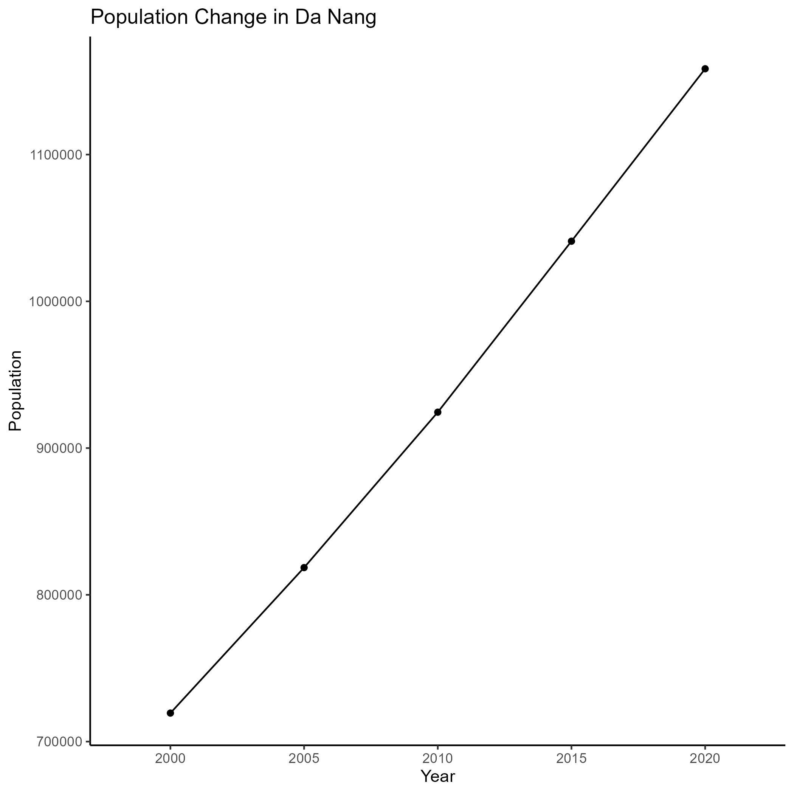
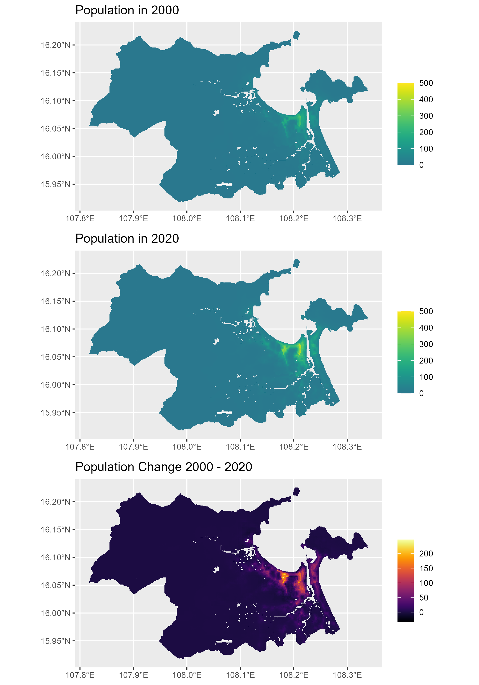

```{r setup, include=FALSE}
knitr::opts_chunk$set(echo = TRUE)
```

## Population analysis

Analyse the change in the population within the Da Nang region as part of identifying the expansion in the urban area.

### Preparation of data

```{r load_libraries}

library(sf)
library(tidyverse)
library(terra)
library(here)
library(tidyterra)
library(viridis)
library(cowplot)

```


```{r load_data}

# load shapefile for Viet Nam
# source: GADM Boundary Data
# https://gadm.org/download_country.html
vietnam_shp <- st_read(here::here("data", "gadm41_VNM_shp", "gadm41_VNM_1.shp"))

# extract Da Nang
danang_shp <- vietnam_shp %>%
  dplyr::filter(VARNAME_1 == "Da Nang")

# load population data
# source: WorldPop Hub Unconstrained individual countries UN adjusted (100m resolution)
# https://hub.worldpop.org/geodata/listing?id=69
pop_2000 <- terra::rast(here::here("data", "pop_data", "vnm_ppp_2000_UNadj.tif"))
pop_2005 <- terra::rast(here::here("data", "pop_data", "vnm_ppp_2005_UNadj.tif"))
pop_2010 <- terra::rast(here::here("data", "pop_data", "vnm_ppp_2010_UNadj.tif"))
pop_2015 <- terra::rast(here::here("data", "pop_data", "vnm_ppp_2015_UNadj.tif"))
pop_2020 <- terra::rast(here::here("data", "pop_data", "vnm_ppp_2020_UNadj.tif"))

# combine layers
pop <- c(pop_2000, pop_2005, pop_2010, pop_2015, pop_2020)
names(pop) <- c(2000, 2005, 2010, 2015, 2020)

# crop to Da Nang
danang_pop <- pop %>%
  terra::crop(., danang_shp) %>%
  terra::mask(., danang_shp)


```

### Overall population change

First, summarise the change in population.

```{r population_summary}

# create table of population
population <- danang_pop %>%
  as_data_frame() %>%
  pivot_longer(., cols = everything()) %>%
  group_by(., name) %>%
  summarise(population = sum(value))

# plot population
pop_graph <- 
  ggplot(population, aes(x = name, y = population, group = 1)) +
  geom_line() + 
  geom_point() + 
  labs(
    x = "Year",
    y = "Population",
    title = "Population Change in Da Nang"
  ) + 
  theme_classic()

ggsave(
  "img/population_growth.png",
  plot = pop_graph
)

```

We can see that the population is increasing rapidly in the last 20 years from 700,000 to over 1,100,000. 



### Population change

Where did the population increase occur?

```{r population_distribution}
# get population change
danang_pop_change <- danang_pop$"2020" - danang_pop$"2000"

# plot population change
plot3 <- 
  ggplot() +
  geom_spatraster(data = danang_pop_change) +
  # set titles
  labs(
    title = "Population Change 2000 - 2020",
    x = NULL,
    y = NULL
  ) +

  scale_fill_viridis(
    name = "",
    na.value = NA,
    # begin = 0.4,
    # end = 1,
    option = "inferno"
  )

# plot population for 2000 and 2020

# values
limits <- c(0, 500)

# plots
plot1 <- 
  ggplot() +
  geom_spatraster(data = danang_pop$"2000") +
  # set titles
  labs(
    title = "Population in 2000",
    x = NULL,
    y = NULL
  ) +

  scale_fill_viridis(
    name = "",
    na.value = NA,
    begin = 0.4,
    end = 1,
    limits = limits
  )

# plots
plot2 <- 
  ggplot() +
  geom_spatraster(data = danang_pop$"2020") +
  # set titles
  labs(
    title = "Population in 2020",
    x = NULL,
    y = NULL
  ) +

  scale_fill_viridis(
    name = "",
    na.value = NA,
    begin = 0.4,
    end = 1,
    limits = limits
  )

# combine into grid
plot_combined <- cowplot::plot_grid(plot1, plot2, plot3, ncol = 1)

```


```{r population_distribution}

ggsave(
  "img/population_change.png",
  plot = plot_combined,
  height = 10
)

```

Quickly we can see that the increase in the population happens in the central district. Some growth of population can be observe along the coastline to the west of the city. Maybe signs of urban sprawl?

We do see some growth along the river - the next question will be - are these disaster prone areas?




